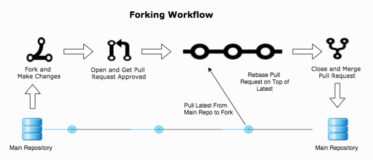

# Forking exercise

## Basic workflow for collaborative programming

In the forking workflow, one repository is the “central” repository but people push to forks, i.e. their own copies of the repository on GitHub (or Gitlab which is another popular platform):

The good things about forking:

- Anybody can contribute without asking for permission (to public projects).
- Maintainer still has full control over what is merged.
- There is now more than one remote to work with.

## Exercise

1. Fork this repository
2. Clone the forked repository to your own computer (i.e. *local copy*)
3. Make changes to the README.md file on your local copy (below)
4. Commit and push your changes to the fork
5. Make a Pull Request (PR) from your own fork to the main repository
6. Check whether some issues were found in the review process
7. When ready, marvel the changes that you made to the main project after the project maintainer has merged the changes to the main repo
8. JLR testing

### Task: Add text below here

HT: test
EA: test
JLR: test2